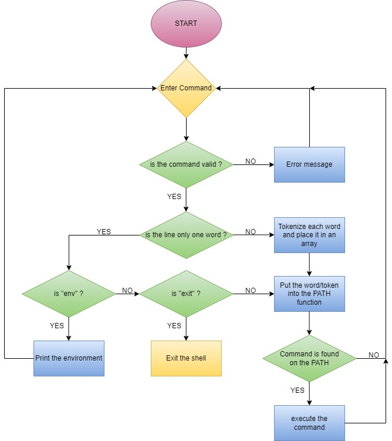

<picture>
 <source media="(prefers-color-scheme: dark)" srcset="https://images.squarespace-cdn.com/content/v1/5a4bfe8bf09ca4228ceca3b7/1539139199598-ANH454IHZI1OKWONKRXY/logo.jpg?format=2500w">
 <source media="(prefers-color-scheme: light)" srcset="https://encrypted-tbn0.gstatic.com/images?q=tbn:ANd9GcQIrK23KvJPB7XdZrIk9mHwe3GZvtsUZLjkh-eG6KRgCLeWu3MW0kFcggq4COpLmeZviQ&usqp=CAU">
 
</picture>

# **Project Simple Shell**

Write a simple UNIX command interpreter in C.

## **Team and Tasks**

This project was released by Nassim Abaida and Marion Laroche in [Holbertonschool](https://www.holbertonschool.fr/?gad_source=1&gclid=CjwKCAiAvoqsBhB9EiwA9XTWGZshq5Y0wpTRGv4wPcY4bKSsX2uqJ0Q8YIAl5CLWh98Fr5Nqb4s6VhoCDUEQAvD_BwE)'s Bordeaux. We work on the campus every day and we make a Check in every morning and a Check out every afternoon. We divided the tasks, but we work in collaboration for all the project (decisions, organisation, commits...).

Our simple shell is a program that takes commands from the keyboard via the terminal, and gives them to the operating system to perform.

## **Its essential functionalities**

Display a prompt and wait for the user to type a command.
Handles commands with arguments.
Handles the PATH global variable.
Runs the following build_in commands: exit, env.
Handles The EOF (End Of File) condition.
The prompt is displayed again each time a command has been executed.

## **List of allowed functions and system calls for this project**

- all functions from string.h
- access (man 2 access)
- chdir (man 2 chdir)
- close (man 2 close)
- closedir (man 3 closedir)
- execve (man 2 execve)
- exit (man 3 exit)
- _exit (man 2 _exit)
- fflush (man 3 fflush)
- fork (man 2 fork)
- free (man 3 free)
- getcwd (man 3 getcwd)
- getline (man 3 getline)
- getpid (man 2 getpid)
- isatty (man 3 isatty)
- kill (man 2 kill)
- malloc (man 3 malloc)
- open (man 2 open)
- opendir (man 3 opendir)
- perror (man 3 perror)
- printf (man 3 printf)
- fprintf (man 3 fprintf)
- vfprintf (man 3 vfprintf)
- sprintf (man 3 sprintf)
- putchar (man 3 putchar)
- read (man 2 read)
- readdir (man 3 readdir)
- signal (man 2 signal)
- stat (__xstat) (man 2 stat)
- lstat (__lxstat) (man 2 lstat)
- fstat (__fxstat) (man 2 fstat)
- strtok (man 3 strtok)
- wait (man 2 wait)
- waitpid (man 2 waitpid)
- wait3 (man 2 wait3)
- wait4 (man 2 wait4)
- write (man 2 write)

## **Compilation**

gcc -Wall -Werror -Wextra -pedantic -std=gnu89 *.c -o hsh

## **Files**

|      file      |                                      description                                         |
|---------------:|------------------------------------------------------------------------------------------|
|          main.h|                                         Header file, contains all prototypes and library.|
|  process-tokens|                                    Process to tokenised the command entered in the shell.|
|         shell.c|    File with the loop, the built in functions, isatty function and exec_command function.|
|   get_fonctions|                                                                     Process for the PATH.|
|          main.c|                                                           Test file for our simple shell.|

## **Flowchart for Simple Shell**

## **Authors**
Abaida Nassim [Github](https://github.com/Nassim33150).

Laroche Marion [Github](https://github.com/Mamuche), [LinkedIn](https://www.linkedin.com/in/marion-laroche-8b235a284/).
